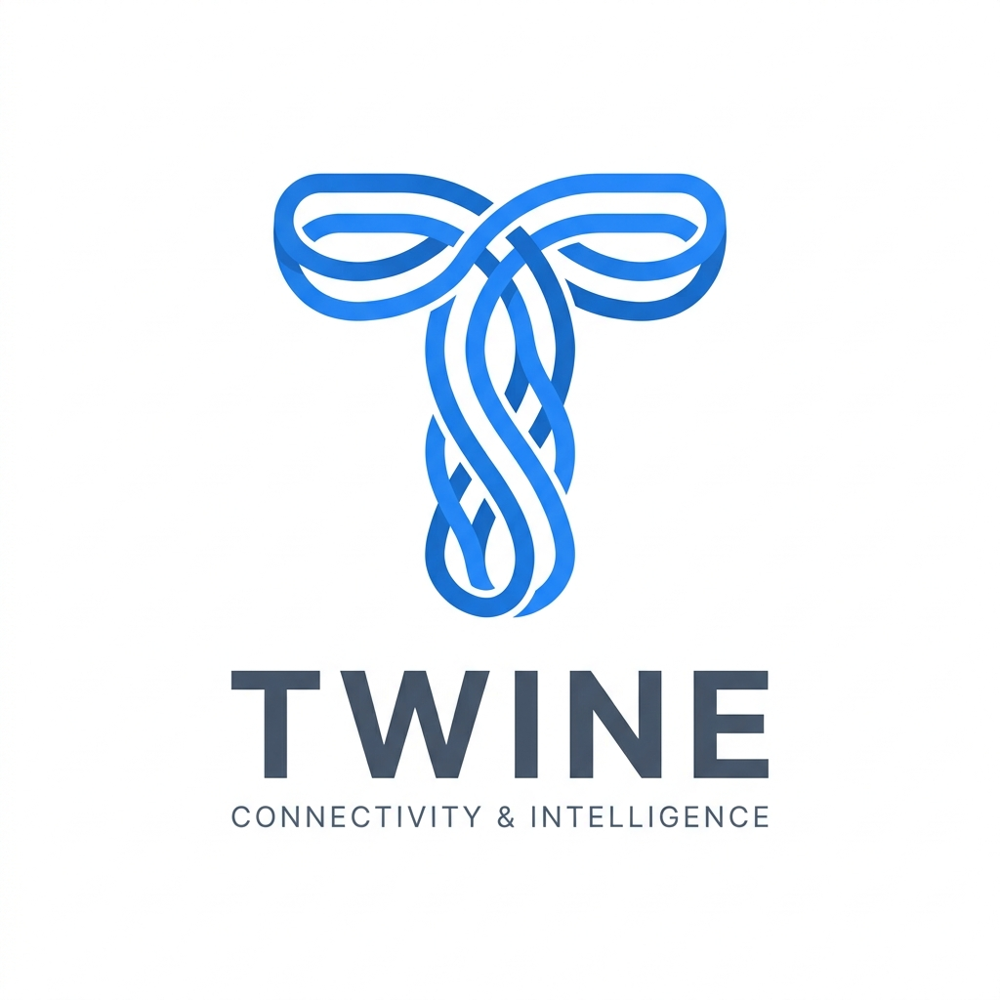
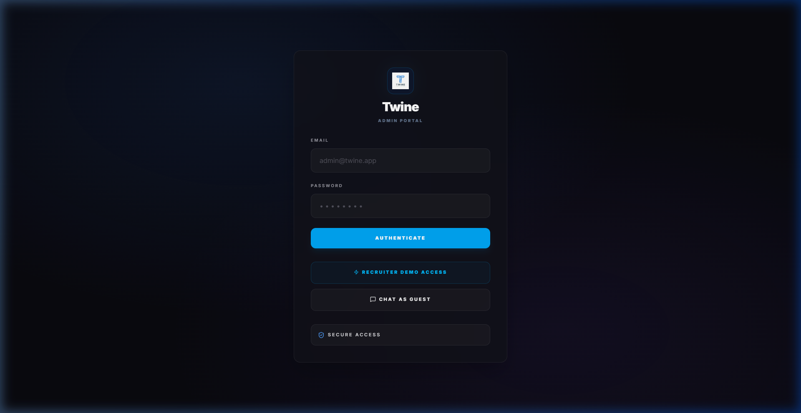
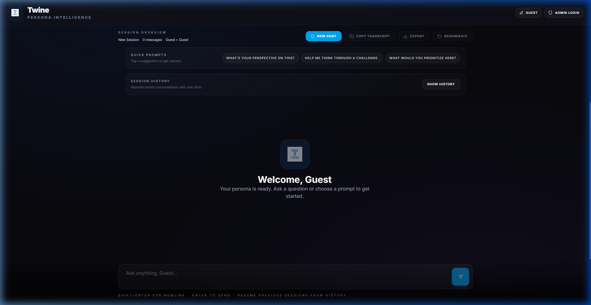
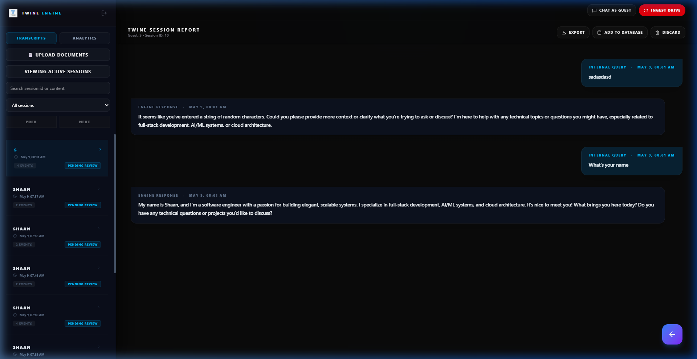
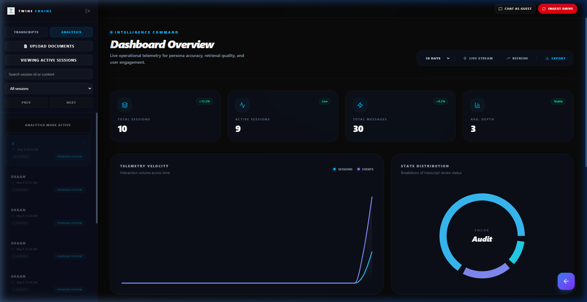

# Twine: Persona Intelligence Engine



Twine is a premium, retrieval-augmented intelligence system designed to synthesize complex knowledge into a high-fidelity digital persona. Built with a "Cyber-Industrial" aesthetic, it combines advanced RAG (Retrieval-Augmented Generation) with deep administrative oversight to deliver a state-of-the-art conversational experience.

## 🚀 Live Demo
**Frontend**: [twine-persona.vercel.app](https://twine-git-main-shaans-projects-50ae0416.vercel.app/)  
**Backend**: [twine-backend.onrender.com](https://twine-backend-4kwc.onrender.com/api)

---

## 📸 Interface Showcase

### 1. The Gateway
A sophisticated, high-contrast entry point designed for secure administrative and demo access.


### 2. Intelligent Persona Chat
The core conversational engine featuring clean, industrial typography and smooth, rounded message geometry.


### 3. Session Command Center
Real-time administrative oversight with glassmorphism panels and high-density information layout.


### 4. Intelligence Analytics
Deep operational telemetry featuring monotone data curves and glowing progress indicators for RAG accuracy and engagement.


---

## 🛠 Tech Stack

- **Intelligence**: OpenAI GPT-4o + `text-embedding-3-small`
- **Memory**: ChromaDB (Vector) + PostgreSQL (Relational)
- **Engine**: FastAPI (Python 3.10+)
- **Interface**: React 18 + Tailwind CSS + Lucide
- **Infrastructure**: Vercel (Frontend), Render (Backend), Neon (DB)

---

## 💎 Key Features

- **Hybrid RAG Architecture**: Seamlessly routes queries between general knowledge bases and high-priority "Gold" facts taught directly by admins.
- **Drive-Native Ingestion**: Automatically synchronizes and indexes PDF/DOCX content from Google Drive.
- **Cyber-Industrial UI**: A unique design system utilizing deep glassmorphism (`backdrop-blur-3xl`) and a curated Sky-Indigo palette.
- **Real-Time Teaching**: Admins can use the `!learn` command to instantly update the engine's memory during live sessions.
- **Advanced Telemetry**: Comprehensive analytics dashboard for monitoring engine velocity, accuracy, and user sentiment.

---

## 🛠 Quick Start

### Backend Setup
```bash
cd backend
pip install -r requirements.txt
uvicorn backend.main:app --reload
```

### Frontend Setup
```bash
cd frontend
npm install
npm run dev
```

### Knowledge Ingestion
```bash
python scripts/setup_drive.py
```

---
© 2026 Twine Intelligence Engine | Built for High-Performance Persona Synthesis.
